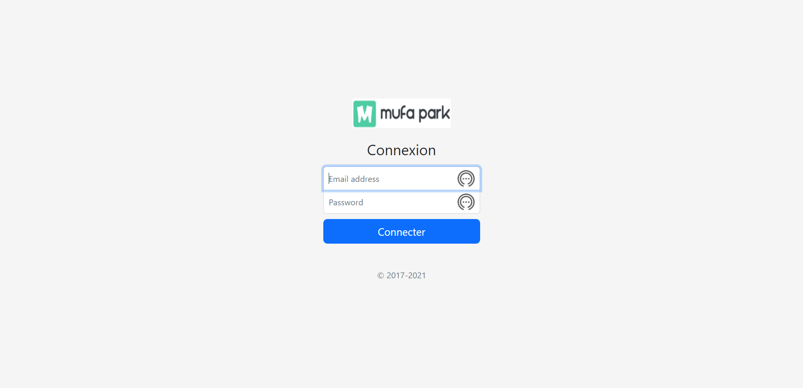
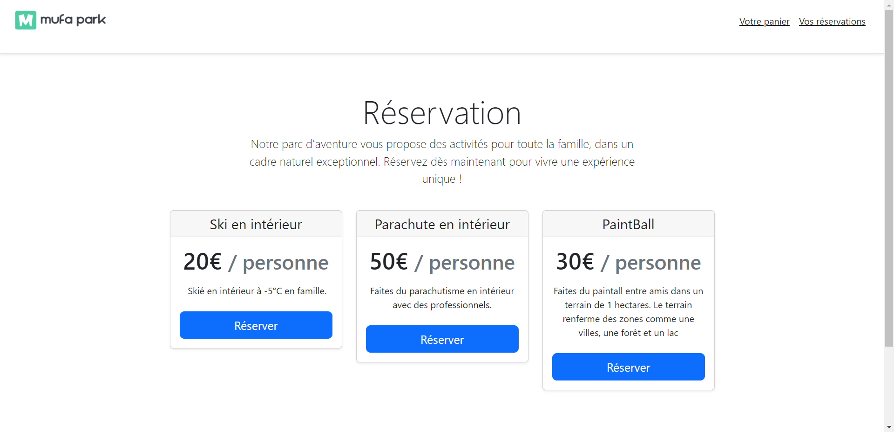
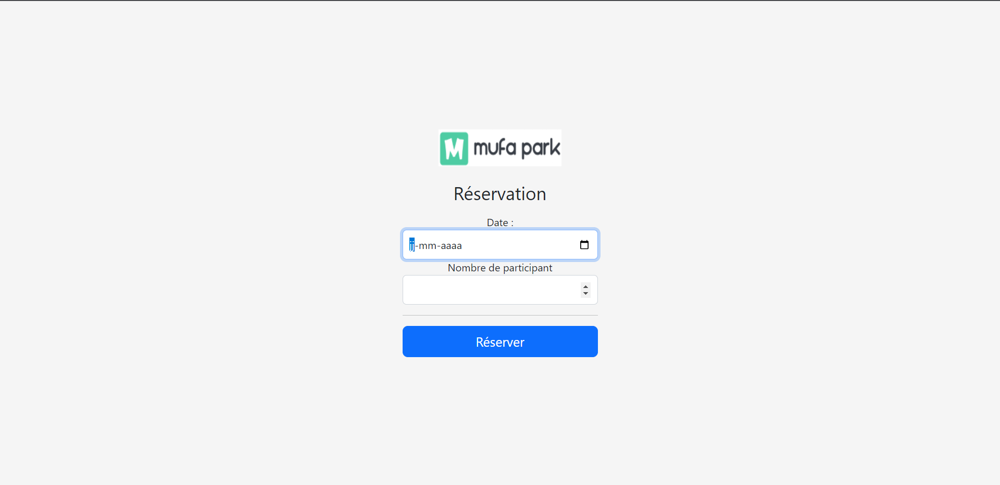
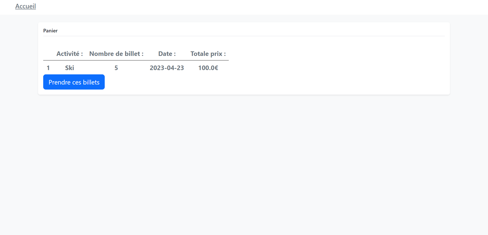
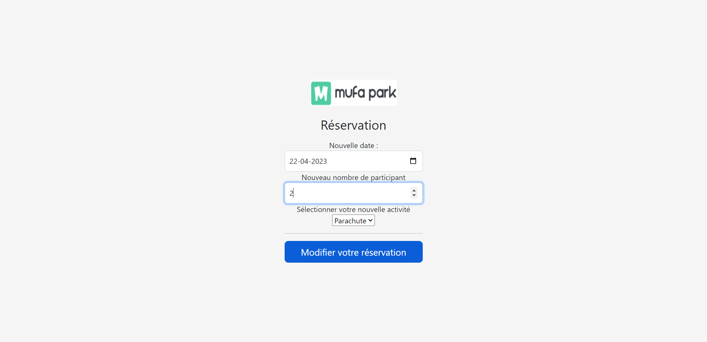
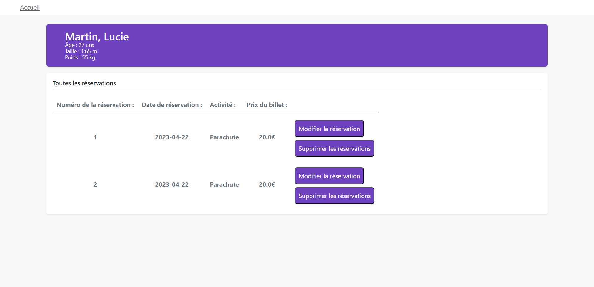

# Mufa Park
## Outils utilisés
J'aimerai devenir un déveleppeur Full-Stack et pour cela, j'ai entrepris la création d'un serveur Web en utilisant le framework Spring en Java
J'ai utilisé Pinegrow pour la conception de l'interface utilisateur du site Web.
Enfin, j'ai opté pour H2 comme système de gestion de base de données SQL.

## Contraintes
Les contraintes mises en places sont :
1. Le programme soit suivre une architecture MVC stricte
2. Faire du suivie de session AVEC un enregistement dans la base de donnée
3. Utilisation d'un Design Patern DAO pour le modèle
4. Faire une API RESTFULL.

## Résultat
Lorsque je me connecte au site, je me situe dans la page où on se connecte.
On remplie le mail et le mot de passe d'un utilisateur qui est déjà inscrit.

  

Ensuite, lorsque le client est connecté, il se trouve directement dans la page où il peut choisir l'activité qu'il veut faire.

  

Lorsqu'on appuie sur le bouton "Réserver", on est dirigé vers une page où on choisis la date et le nombre de participant de l'activité.

  

On appuie sur le bouton et la réservation sera sauvegarder dans un suivie de session qui sera aussi sauvegarder dans une table temporaire. Á l'accueil, on peut appuyer sur le panier et voir ce qu'on a dans le panier.

  

Lorsque la réservation est confirmer, on est redirigé vers l'accueil et on peut appuyer sur "Mes réservations" pour voir toutes les réservations qu'on a faite.

  

Dans cette page, on peut supprimer ou modifier.
Lorsqu'on appuie sur le bouton supprimer, il supprime tous les tickets.
Et avec le bouton modifier, il nous redirige vers une autre page où on modifie la réservation.

  

Et lorsqu'on modifie, on a donc une nouvelle page de réservation.

  

